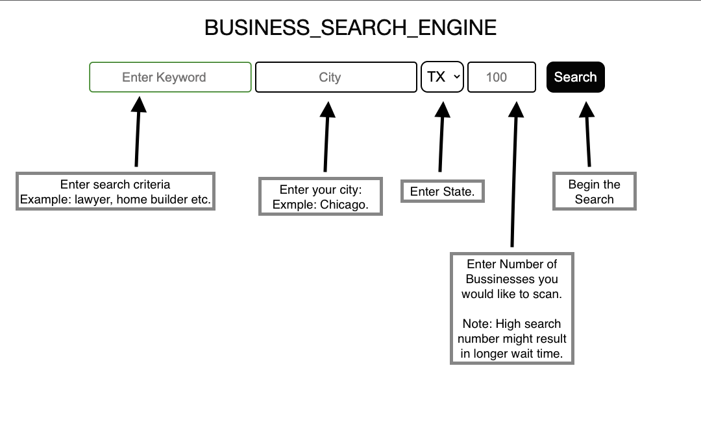
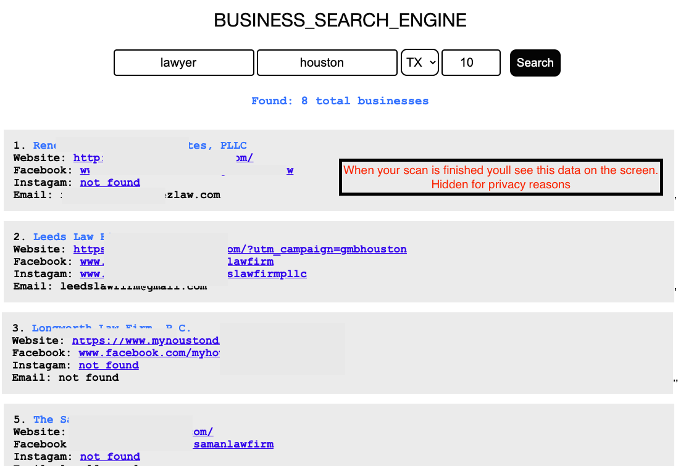

This apps provides key data for those who are searching for new customers,
business emails and social media profiles of public businesses.

Installation:

1. Make sure that Node.js is installed on your computer. You can download it from **https://nodejs.org/**.

2. Navigate your terminal to the app folder using the **cd** command followed by the path to your app folder.
    For example: **cd path/to/app-folder**.

3. Install all node_modules by running the command **npm install**. 
    This will install all the dependencies and devDependencies listed in the package.json file.

4. Run the app by executing the command **npm run start**. 
    This would start the local server on localhost:5000.

5. Insert localhost:5000 into your web browser's address bar.

6. After finished using the app run command **Command + 'C'** for MAC, or **Ctrl + 'C'** for Windows
    This would stop local server running.

**For App Manual please scroll down and follow instructions.**

All Steps Happening Behind the Scene:

1. Inputs your data to Google maps and searches for search keywords

2. Retrieves Google maps DOM tree and copies all relative values:

   - Bussiness name
   - Website

3. Goes to each business websites and searches for:

   - Email
   - Facebook Page
   - Instagram Page

**Regular expression is used to find values on each website**

4. If no email found on the bussiness page and/or found Facebook page,

   - Searches for email on facebook

5. Returns all data found to your Window

6. Creates text file with all search values in the "Marketing data" folder in the same directory for your convinience.
    Check example called "cpa-chicago-IL.txt"

HINT: While App is running and loading data You can access "unfiltered Data" in the same Terminal where your server runs.

Input values as shown on this picture:

Results with scanned searches should look like this:

**NOTE: This app is for private use only. Unauthorized use or distribution of the collected data is strictly prohibited.**
